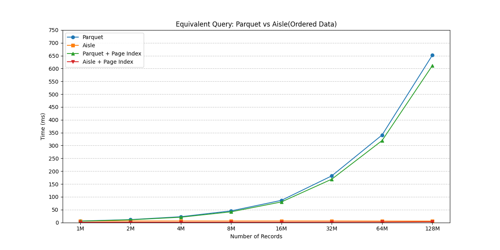
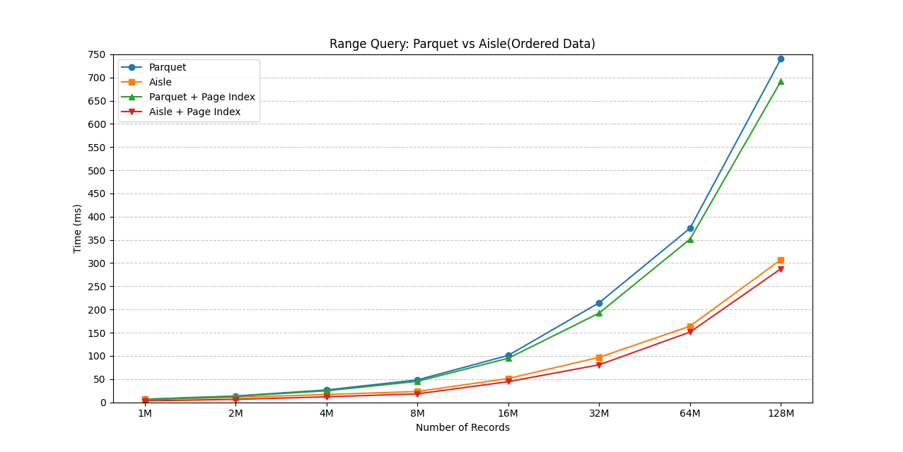

# Aisle

Aisle is a high-performance Parquet file reader that implements page-level predicate pushdown for efficient data filtering. By pushing predicates down to individual pages using statistics, Aisle significantly reduces I/O operations and memory usage compared to traditional Parquet readers.

## Features

- **Predicate Pushdown**: Filters data at row group, page, and row levels to minimize I/O.
- **High Performance**: Efficient for selective queries on large datasets.
- **Easy Integration**: Drop-in replacement for [Parquet ParquetRecordBatchStreamBuilder](https://docs.rs/parquet/latest/parquet/arrow/async_reader/type.ParquetRecordBatchStreamBuilder.html) and minimal code changes required to migrate.

## Why We Built Aisle
In developing [Tonbo](https://github.com/tonbo-io/tonbo), we need an efficient Parquet reader that could take advantage of page indexes and filters. But [Parquet](https://github.com/apache/arrow-rs/tree/main/parquet) doesn't utilize page index and only filter data at row level. Aisle address these needs by providing:
- Row group level filters by using row group statistics
- Page level filters by using page statistics
- Row level filters provided by [Parquet ParquetRecordBatchStreamBuilder](https://docs.rs/parquet/latest/parquet/arrow/async_reader/type.ParquetRecordBatchStreamBuilder.html)

Aisle provides the most benefit in the following scenarios:
1. **Selective Queries**: The more selective your predicates, the greater the benefit from page-level filtering.
2. **Sorted or Partially Sorted Data**: When data are generally ordered across row groups or pages, Aisle will become more effective

If your columns are totally random values(e.g. identifiers or uuids), we recommend to disable page index in `ArrowReaderOptions`

## Performance Benchmark





See benchmark for more [details](./benches/read_bench.rs).

See more benchmark results [here](./docs/benchmark.md)

## Installation

### Requirements
- Rust
- parquet 55.1.0 or later

Add Aisle to your `Cargo.toml`:

```toml
[dependencies]
aisle = { git = "https://github.com/tonbo-io/aisle.git", branch = "main" }
parquet = { version = "55.1.0" }
```

## Usage

The basic usage is similar to  [Parquet ParquetRecordBatchStreamBuilder](https://docs.rs/parquet/latest/parquet/arrow/async_reader/type.ParquetRecordBatchStreamBuilder.html#method.new)
```rust
use aisle::{
    ArrowReaderOptions, ParquetRecordBatchStreamBuilder, ProjectionMask,
    filter::RowFilter,
};
use fusio::{DynFs, disk::TokioFs, fs::OpenOptions, path::Path};
use fusio_parquet::reader::AsyncReader;
use futures_util::StreamExt;

#[tokio::main]
async fn main() -> Result<(), Box<dyn std::error::Error>> {
    // Create AsyncFileReader
    let fs = TokioFs {};
    let file = fs
        .open_options(
            &Path::new("./data/data.parquet").unwrap(),
            OpenOptions::default().read(true),
        )
        .await?;
    let size = file.size().await.unwrap();
    let reader = AsyncReader::new(file, size).await.unwrap();

    // Initialize builder with page index enabled
    let builder = ParquetRecordBatchStreamBuilder::new_with_options(
        reader,
        ArrowReaderOptions::new().with_page_index(true),
    )
    .await?;

    // Build and process the filtered stream
    let mut stream = builder
        .with_row_filter(RowFilter::new(filters))
        .with_limit(10)
        .with_projection(ProjectionMask::all())
        .build()?;

    while let Some(batch_result) = stream.next().await {
        let batch = batch_result?;
        // Process your batch
    }

    Ok(())
}
```

### Creating Predicates

```rust
use aisle::{
    ProjectionMask,
    ord::{gt, lt},
    filter::RowFilter,
    predicate::{AislePredicate, AislePredicateFn},
};
use arrow::array::{Datum, UInt64Array};
use std::sync::Arc;

// Create range predicate (100 < x < 1000)
let schema = builder.parquet_schema();
let filters: Vec<Box<dyn AislePredicate>> = vec![
    Box::new(AislePredicateFn::new(
        ProjectionMask::roots(schema, vec![0]),
        |batch| {
            let key = Arc::new(UInt64Array::new_scalar(100)) as Arc<dyn Datum>;
            gt(batch.column(0), key.as_ref())
        },
    )),
    Box::new(AislePredicateFn::new(
        ProjectionMask::roots(schema, vec![0]),
        |batch| {
            let key = Arc::new(UInt64Array::new_scalar(1000)) as Arc<dyn Datum>;
            lt(batch.column(0), key.as_ref())
        },
    )),
];

// Build with row filter
let stream = builder.with_row_filter(RowFilter::new(filters)).build()?;
```

### Migration Guide
Migrating from Parquet `ParquetRecordBatchStreamBuilder` to Aisle is straightforward, just follows these steps:

1. replace Parquet `ParquetRecordBatchStreamBuilder` with Aisle `ParquetRecordBatchStreamBuilder`
2. replace Parquet `RowFilter` with aisle `RowFilter`
3. replace Parquet `ArrowPredicateFn` with `AislePredicateFn`
4. replace Parquet `gt`, `gt_eq`, `lt`, `lt_eq` with Aisle `gt`, `gt_eq`, `lt`, `lt_eq`

## Limitation
Only `>`, `>=`, `<`, `<=` are supported for now. If you want to use `=` or other operations, please use them in combination. For example:

```rust
// x = 100 becomes x >= 100 AND x <= 100
let filters: Vec<Box<dyn AislePredicate>> = vec![
    Box::new(AislePredicateFn::new(
        ProjectionMask::roots(schema, vec![0]),
        |batch| {
            let key = Arc::new(UInt64Array::new_scalar(100)) as Arc<dyn Datum>;
            gt_eq(batch.column(0), key.as_ref())
        },
    )),
    Box::new(AislePredicateFn::new(
        ProjectionMask::roots(schema, vec![0]),
        |batch| {
            let key = Arc::new(UInt64Array::new_scalar(100)) as Arc<dyn Datum>;
            lt_eq(batch.column(0), key.as_ref())
        },
    )),
];
```

## Development

### Building

Build the project:
```bash
cargo build
```

### Testing
Run tests:
```bash
cargo test
```

Run benchmark:
```bash
cargo bench --bench read_bench --features tokio
```
