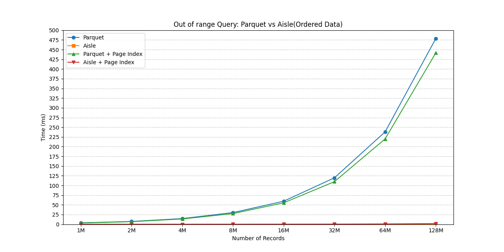
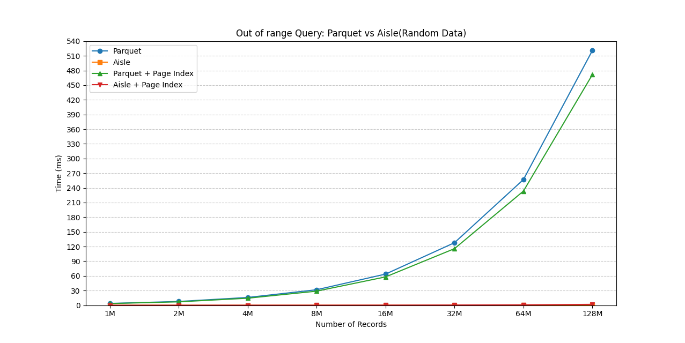
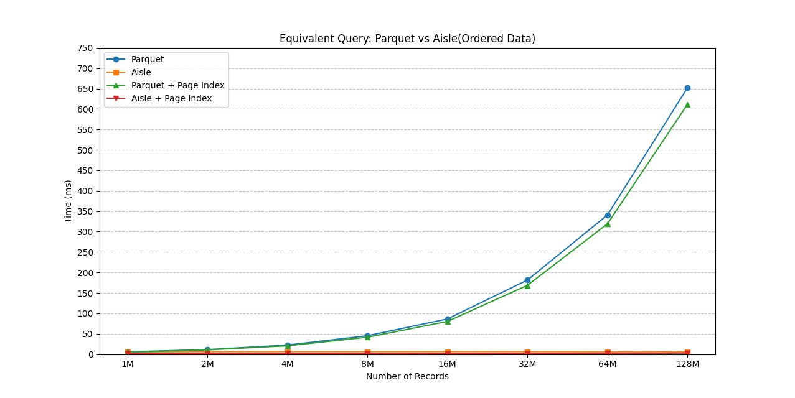
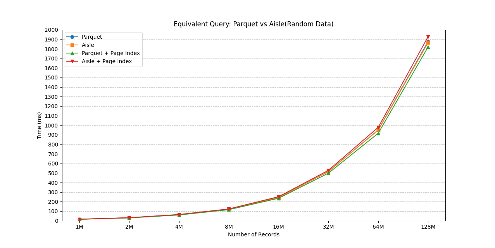
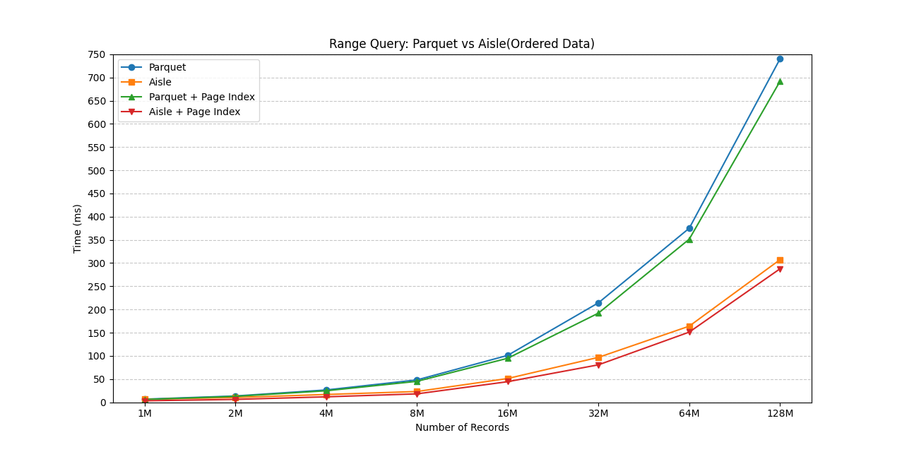
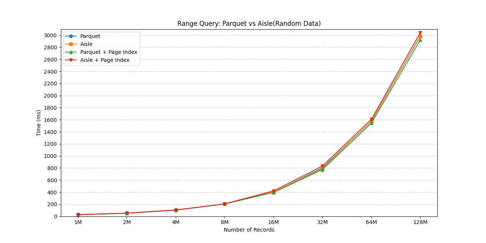

# Aisle Benchmark Results

## Testing data

We have two kinds of test data, one is ordered data, and the other is completely out of order data.

## Read No Page Performance

## Equivalent Query  Performance

## Range Query Performance

